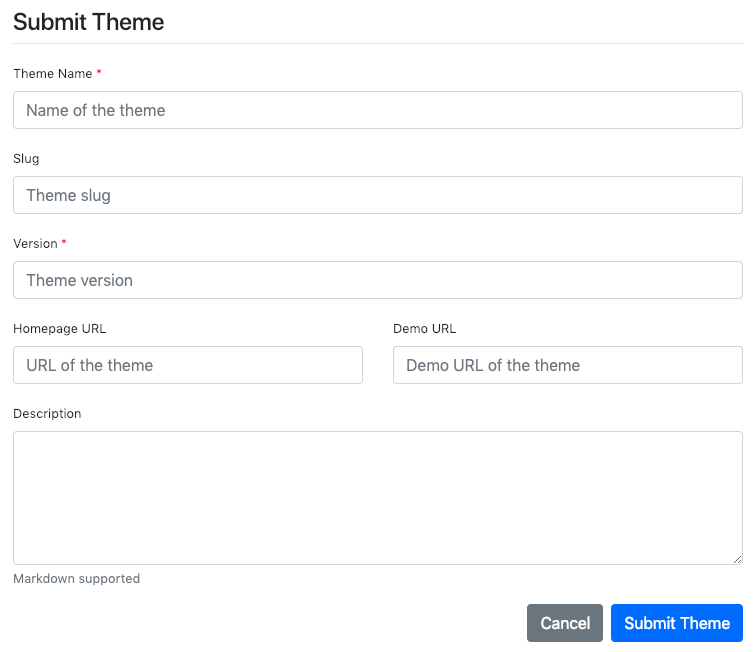
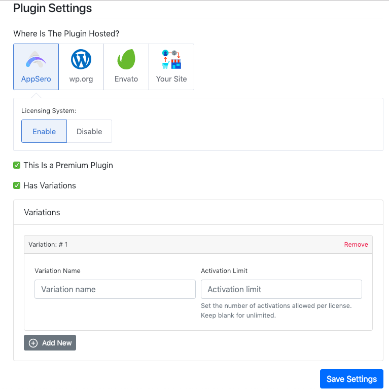

# Adding a Theme

## Basic Information

To add theme go to <code>Themes</code> menu then click on <code>Add Theme</code> button. Fill up the form with following information:

### Available fields
<table>
    <tr>
        <th>Name</th>
        <th>Required</th>
        <th>Description</th>
    </tr>
    <tr>
        <td> Theme Name </td>
        <td> Yes </td>
        <td> The name of the theme. </td>
    </tr>
    <tr>
        <td> Slug </td>
        <td> Yes </td>
        <td> Slug of the theme. It will be generated automatically but if you want you can change it. Note that you will not be able to update it later.| </td>
    </tr>
    <tr>
        <td>Version</td>
        <td>Yes</td>
        <td>The version of the theme. You will be able to add new version at the time of release.</td>
    </tr>
    <tr>
        <td>Homepage URL</td>
        <td>No</td>
        <td>Webiste URL of the theme. Put Website URL based on hosted store. Put WordPress.org url of the theme if it is hosted on WordPress.org. </td>
    </tr>
    <tr>
        <td>Demo URL</td>
        <td>No</td>
        <td>Demo site URL of the theme.</td>
    </tr>
    <tr>
        <td>Description</td>
        <td>No</td>
        <td> Give a description of the theme. This field is markdown supported. </td>
    </tr>
</table>

After fill up the form click on <code>**Submit Theme**</code> button. 

> Congratulations :tada: the theme has been created. 
  Please update settings.

## Theme Settings
After submitting the theme it will be redirected to <code>Theme Settings</code> page. On settings page update following information. 

### Where Is The Theme Hosted
Select the theme’s hosted site among **[AppSero](#appsero)**, **[WordPress.org](#wordpress-org)**, **[Envato](#envato)** and **[Your Site](#your-site)**. 

### AppSero
Select AppSero if the theme hosted on appaero.com after that you will get an option to enable licensing. If you would like to manage licencing for this theme then <code>Enable</code> licencing system otherwise <code>Disable</code> it. 

If this is a premium theme then check on <code>This Is a Premium theme</code>. 

If enable <code>This Is a Premium Theme</code> then you will get an option  for variation. If the theme has multiple variations then check on <code>Has Variations</code> and add variations by providing <code>Variation Name</code> and <code>Activations limit.</code> 

### WordPress.org
Licensing is not available for the theme hosted on WordPress.org.

### Envato
To enable licencing using envato purchase key click on <code>Use Envato Purchase Code</code> button. If don’t need licensing then click <code>Not Using Any</code> button.  To use Envato licensing by purchase code you have to [connect](envato-licensing.md) this theme with your Envato item. 

[Click Here To Learn More About Envato Licensing](envato-licensing.md) 

### Your Site
Select the theme you are using for billing. There are two options one is <code>Easy Digital Downloads</code> another <code>WooCommerce.</code> 

#### Select your prefered licence manager. 
For <code>Easy Digital Downloads</code> there are two options one <code>EDD Software Licencing</code> another <code>AppSero</code> native. Select your preferred licensing system. If the theme don’t need licencing then click on <code>Not Any</code>. 

For <code>WooCommerce</code> there are three options <code>WooCommerce API Manager</code>, <code>WooCommerce Software Add-on</code>, <code>AppSero</code> Native Licensing. Select your preferred licensing system.  If the theme don’t need licencing then click on <code>Not Any</code>. 

If this is a premium theme then check on <code>This Is a Premium Theme</code> checkbox. 

If enable <code>This Is a Premium theme</code> then you will get an option  for variation. If the theme has multiple variations then check on <code>Has Variations</code> and add variations by providing <code>Variations Name</code> and <code>Activations limit.</code> 
  

Finally click on <code>**Save Settings**</code> button. 

> Congratulations, Theme Settings has been Updated. :slightly_smiling_face:

