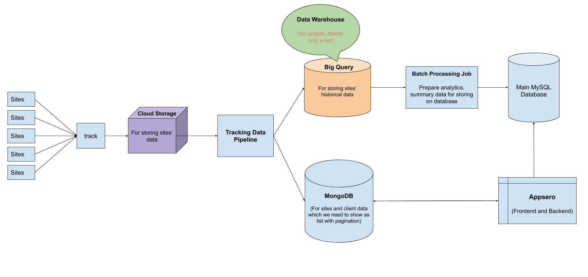

# System Architecture of Deactivation



## Deactivate:
Deactivate is part of the tracking app. The tracking app is running on google cloud run which is a serverless service of GCP. It’s developed using the Golang programming language. We used Go/Golang because Golang is a compiled, statically typed language which made it super faster to execute. We used the GCP cloud run for auto-scaling means we don’t need to worry about scaling about the tracking application. GCP will manage it for us.

## Repository of tracking app:
[https://github.com/Appsero/track](https://github.com/Appsero/track)

We have to build a docker image to run this application on the GCP cloud run. There is a Dockerfile on the repository so we just have to build the docker image. 

## Build the docker image:
```gcloud builds submit --tag gcr.io/appsero/track```

## Publish Cloud Run:
```gcloud run deploy --image gcr.io/appsero/track --platform managed```


## Cloud Storage:
The deactivate endpoint of the tracking app saves the data as JSON on Cloud Storage. It stores data by creating a folder based on the current year, month, date, hour. 

**Structure:** ```Bucker/deactivate/Year/Month/Day/Hour```

**Example:** ```gs://appsero-tracking/deactivate/2020/12/09/10/```

## Deactivate Data Pipeline:
Deactivate data pipeline read JSON data from cloud storage and process those data and save to BigQuery and MongoDB. This data pipeline has been developed using Apache Beam with Python. 

> Apache Beam is an open-source unified programming model to define and execute data processing pipelines, including ETL, batch, and stream (continuous) processing. Beam Pipelines are defined using one of the provided SDKs and executed in one of the Beam’s supported runners (distributed processing back-ends) including Apache Flink, Apache Samza, Apache Spark, and Google Cloud Dataflow.

We are using Google Cloud Dataflow for running the Apache Beam data pipeline. And Cloud Scheduler for running Dataflow data pipeline hourly.

## MongoDB:
MongoDB data is used to store all deactivations with the latest information. This deactivations table is being used to show the deactivations list on the appsero dashboard with pagination. This MongoDB database is also used to store project information with mail integration and custom fields which is needed on validation of the deactivation data pipeline.

## BigQuery:
BigQuery is being used as a data warehouse. We are storing historical data of deactivations into the BigQuery deactivations table. The difference between the MongoDB deactivations table and the BigQuery deactivations table is that the MongoDB deactivations table is used to store the latest information, it doesn’t store historical data of the deactivations. On the other hand, BigQuery stores the historical data of the deactivations.


## Batch Processing Job:
This step creates analytics data from BigQuery for showing the charts on the appsero dashboard. This job runs hourly. 
