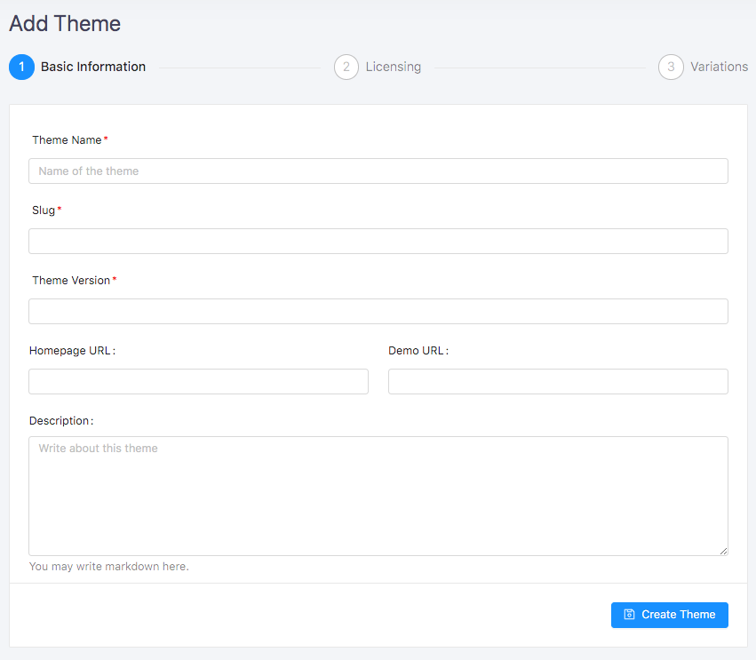
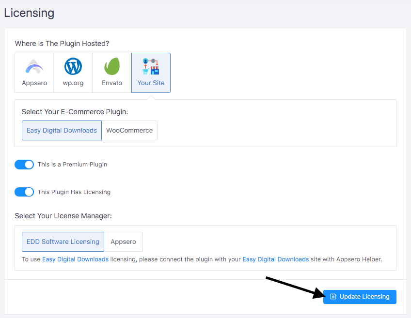
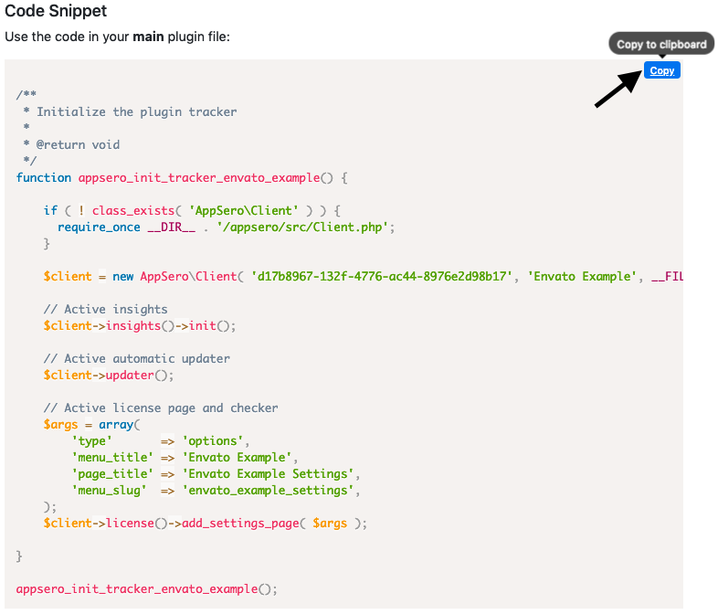

# Add Plugin/Theme Stored in Your Store

<br/>

<iframe width="100%" height="400" src="https://www.youtube.com/embed/3DHdb1zraq0" frameborder="0" allow="accelerometer; autoplay; encrypted-media; gyroscope; picture-in-picture" allowfullscreen></iframe>

<br/>
<br/>

- **Follow the following steps if the Plugin/Theme hosted on Your Site**
    - [Add Plugin/Theme](#add-plugin-theme)
    - [Update Settings](#update-settings)
    - [Install Appsero Client](#install-appsero-client)

## Add Plugin/Theme
If you would like to add Appseo analytics to your Plugin then [Add a plugin](#add-a-plugin). For theme [Add a theme](#add-a-theme)

### Add a Plugin
To add new plugin go to `Plugins` menu then click on `Add Plugin` button. Fill up the form with the following information:

#### Available Fields
<table>
    <tr>
        <th>Name</th>
        <th>Required</th>
        <th>Description</th>
    </tr>
    <tr>
        <td> Plugin Name </td>
        <td>  <code>Yes</code> </td>
        <td> The name of the plugin. </td>
    </tr>
    <tr>
        <td> Slug </td>
        <td>  <code>Yes</code>  </td>
        <td> Slug of the plugin. It will be generated automatically but you can change it. Note that you will not be able to update it later. </td>
    </tr>
    <tr>
        <td>Version</td>
        <td> <code>Yes</code> </td>
        <td>The version of the plugin. You will be able to add new version at the time of release.</td>
    </tr>
    <tr>
        <td>Requires PHP Version </td>
        <td> <code>Yes</code> </td>
        <td>Requires PHP Version for the plugins.</td>
    </tr>
    <tr>
        <td>Requires WordPress Version </td>
        <td> <code>Yes</code> </td>
        <td>WordPress version requires for the plugin.</td>
    </tr>
    <tr>
        <td>Tested up to </td>
        <td> <code>Yes</code> </td>
        <td>Maximum version of WordPress the plugin has been tested.</td>
    </tr>
    <tr>
        <td>Homepage URL</td>
        <td> <code>No</code> </td>
        <td> Website URL of the plugin. Put Website URL based on the hosted store. Put WordPress.org URL of the plugin, if it is hosted on WordPress.org. </td>
    </tr>
    <tr>
        <td>Demo URL</td>
        <td> <code>No</code> </td>
        <td>Demo site URL of the plugin.</td>
    </tr>
    <tr>
        <td>Description</td>
        <td> <code>No</code> </td>
        <td>Give a description of the plugin. This field is markdown supported.</td>
    </tr>
</table>

<br>


After filling up the form click on **`Submit Plugin`** button. 

### Add a Theme

To add theme go to `Themes` menu then click on `Add Theme` button. Fill up the form with the following information:

#### Available fields
<table>
    <tr>
        <th>Name</th>
        <th>Required</th>
        <th>Description</th>
    </tr>
    <tr>
        <td> Theme Name </td>
        <td>  <code>Yes</code> </td>
        <td> The name of the theme. </td>
    </tr>
    <tr>
        <td> Slug </td>
        <td>  <code>Yes</code>  </td>
        <td> Slug of the theme. It will be generated automatically but if you want you can change it. Note that you will not be able to update it later.| </td>
    </tr>
    <tr>
        <td>Version</td>
        <td> <code>Yes</code> </td>
        <td>The version of the theme. You will be able to add new version at the time of release.</td>
    </tr>
    <tr>
        <td>Homepage URL</td>
        <td> <code>No</code> </td>
        <td>Website URL of the theme. Put Website URL based on the hosted store. Put WordPress.org URL of the theme if it is hosted on WordPress.org.</td>
    </tr>
    <tr>
        <td>Demo URL</td>
        <td> <code>No</code> </td>
        <td>Demo site URL of the theme.</td>
    </tr>
    <tr>
        <td>Description</td>
        <td> <code>No</code> </td>
        <td> Give a description of the theme. This field is markdown supported. </td>
    </tr>
</table>




After filling up the form click on **`Submit Theme`** button. 


> Congratulations :tada: the project has been created. 
<br> Please update settings.


## Update Settings

Select the plugin you are using for billing. There are two options one is <code>Easy Digital Downloads</code> another <code>WooCommerce.</code> 

#### Select your preferred license manager. 
For <code>Easy Digital Downloads</code> there are two options one <code>EDD Software Licencing</code> another <code>Appsero</code> native. Select your preferred licensing system. If the plugin doesn’t need licensing then click on <code>Not Any</code>. 

For <code>WooCommerce</code> there are three options <code>WooCommerce API Manager</code>, <code>WooCommerce Software Add-on</code>, <code>Appsero</code> Native Licensing. Select your preferred licensing system.  If the plugin doesn’t need licencing then click on <code>Not Any</code>. 
If this is a premium plugin then check on <code>This Is a Premium Plugin</code> checkbox. 

If enabled <code>This Is a Premium Plugin</code> then you will get an option  for variation. If the plugin has multiple variations then check on <code>Has Variations</code> and add variations by providing <code>Variations Name</code> and <code>Activations limit.</code> 
<br><br>



Finally, click on <code>**Save Settings**</code> button. 


## Install Appsero Client

You can install Appsero Client in two ways, via composer and manually.

### 1. Composer Installation

Add dependency in your project (theme/plugin):

```
composer require appsero/client
```

Now add `autoload.php` in your file if you haven't done already.

```php
require __DIR__ . '/vendor/autoload.php';
```

### 2. Manual Installation

Clone the repository in your project.

```
cd /path/to/your/project/folder
git clone https://github.com/Appsero/client.git appsero
```

Now include the dependencies in your plugin/theme.

```php
require __DIR__ . '/appsero/src/Client.php';
```

### Enable Insights, Updater, Licensing

To enable insight go to `User Guide` page and copy the **Code Snippet** and use on the main plugin file. For themes use on themes functions.php file.



> Well done, You install Appsero client to your Plugin/Theme

