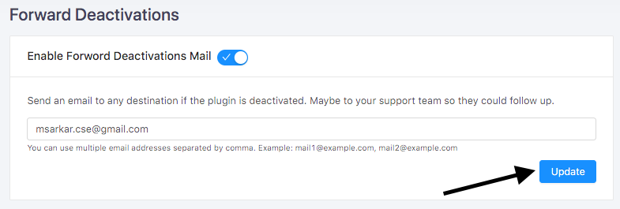
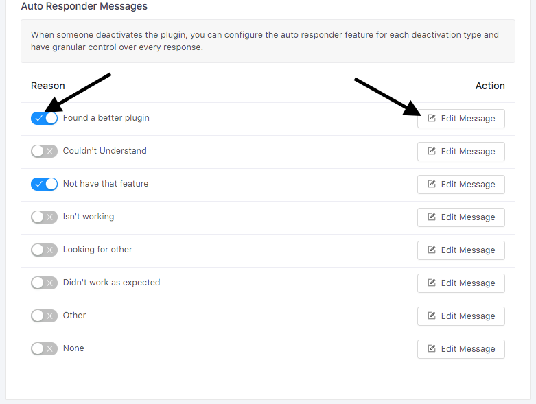

# Forward Deactivation Mail

## Forward Deactivation to Support

To get an email when someone deactivates the Plugin/Theme enable `Forword Deactivations Mail`.

To enable `Forword Deactivations Mail` go to `Settings` page. Under `General Settings` there is an option for `Forword Deactivations Mail`. 

Check on `Forword Deactivations Mail` after that you will get an input field for email. Add comma separated emails. AppSero will send email to those emails when someone deactivates the plugin/theme. 

And finally,     click on `Update Settings` button.

> Forward Deactivation Mail has been enabled. Now, you will receive email while someone deactivates the Plugin/Theme.

## Deactivation Auto Responder 

When someone deactivates the plugin, you can configure the auto responder feature for each deactivation type and have granular control over every response.

If you would like to enable `Deactivation Auto Responder` then go to `Deactivation Auto Responder` tab under `Settings` page and enable `Deactivation Auto Responder`. 
 

`Deactivation Auto Responder` has been enabled. Now enable reason wise Auto Responder and edit the messages. 

After clicking on the `Edit` button you will get a form with email subject and email body. 

Fill up the form with email's Subject and Body. This email will be sent to the customer for this deactivation. Finally, click on `Update` button.

> Deactivation Auto Responder has been enabled successfully. Now AppSero will email customer if they deactivate the Plugin/Theme. 